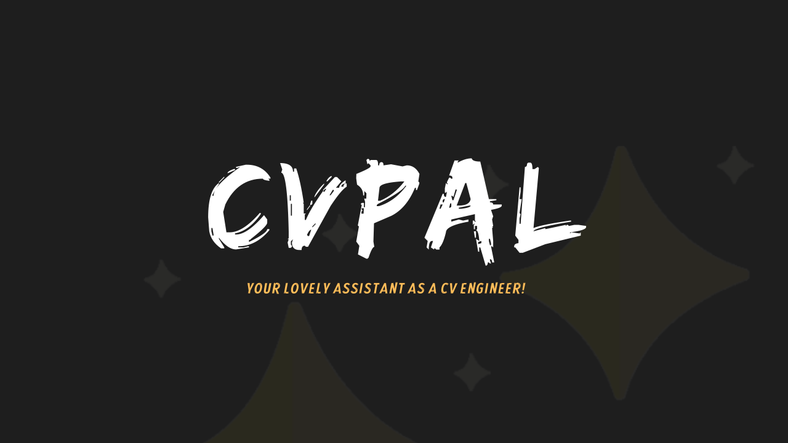

<h1 align="center"><b>CvPal</b></h1>
<p align="center">
  
</p>

<div align="center">

<div>
    <br>
    <a href="https://colab.research.google.com/drive/1Q_gYCQv85ImulAPXgQ1qOa_HGA7aytec?usp=sharing"></a>
</div>
</div>

## Introduction

Welcome to **CvPal**!👋

**CvPal** is a powerful Python package designed to assist Computer Vision engineers in performing a variety of image operations. The primary goal of **cvPal** is to simplify the process of image manipulation and dataset management, enabling engineers to focus on building and optimizing their machine learning pipelines.

With **CvPal**, you can easily handle tasks such as merging datasets, removing specific labels, counting label occurrences, and generating comprehensive reports on your dataset, all with a user-friendly interface and comprehensive documentation.

## Features

- **Dataset Merging**: Functions to seamlessly merge different datasets, each with multiple attributes.
- **Label Removal**: Functions to remove specific labels from your dataset.
- **Label Occurrence Counting**: Functions to count the occurrences of specific labels.
- **Dataset Reporting**: Functions to generate comprehensive reports on your dataset.
- **Easy Integration**: Seamlessly integrate with existing ML pipelines.
- **Comprehensive Documentation**: Detailed documentation to guide you through all features and functionalities.


## Dataset Folder Structure

To ensure **CvPal** works properly, the provided dataset folder should follow this structure:

- **folder/**
  - **train/**
    - **images/**
    - **labels/**
  - **test/**
    - **images/**
    - **labels/**
  - **valid/**
    - **images/**
    - **labels/**

Additionally, for datasets using TXT format, a `data.yaml` config file is required:

- **folder/**
  - `data.yaml`

Example `data.yaml`:

```yaml
names:
  - Old_Paper
  - Rock
  - Scissors
nc: 3
roboflow:
  license: Private
  project: rock-paper-scissors-sxsw
  url: https://universe.roboflow.com/roboflow-58fyf/rock-paper-scissors-sxsw/dataset/14
  version: 14
  workspace: roboflow-58fyf
test: ../test/images
train: Rock-Paper-Scissors-SXSW-14/train/images
val: Rock-Paper-Scissors-SXSW-14/valid/images
```

## Installation

You can install **CvPal** via pip:

```bash
pip install cvpal==0.0.2

```
## Example Usage

```bash
from cvpal import CvPal

cp = CvPal()

# Read data from the specified directory
cp.read_data("/content/Rock-Paper-Scissors-SXSW-14", data_type="txt")

# Generate a comprehensive report on the dataset
cp.report()
```

## Supported Models and Formats
| Model Name                             | Supported Format         | Support in Package       | Detection | Segmentation |
|----------------------------------------|--------------------------|--------------------------|-----------|--------------|
| YOLOv3                                 | Darknet TXT              | ❌                       | ❌        | ❌           |
| YOLOv4                                 | Darknet TXT              | ❌                       | ❌        | ❌           |
| YOLOv5                                 | TXT & YAML config        | ✅                       | ✅        | ❌           |
| YOLOv7                                 | TXT & YAML config        | ✅                       | ✅        | ❌           |
| YOLOv8                                 | TXT & YAML config        | ✅                       | ✅        | ❌           |
| YOLOv9                                 | TXT & YAML config        | ✅                       | ✅        | ❌           |
| EfficientDet                           | Pytorch JSON annotations | ❌                       | ❌        | ❌           |
| Detectron 2                            | JSON annotations         | ❌                       | ❌        | ❌           |
| Segmentation Models                    | XML format               | ❌                       | ❌        | ❌           |
| Tensorflow 1.5 Object Detection models | Binary format            | ❌                       | ❌        | ❌           |
| Tensorflow 2.0 Object Detection models | Binary format            | ❌                       | ❌        | ❌           |
| Fine-tune PaliGemma                    | JSONL annotations        | ❌                       | ❌        | ❌           |
| Apple's CreateML                       | Proprietary JSON format  | ❌                       | ❌        | ❌           |
| Turi Create tools                      | Proprietary JSON format  | ❌                       | ❌        | ❌           |


## Call for Contributions
<p>We Need Your Help The cvPal project values your skills and passion!</p>
<p>We appreciate any small enhancements or fixes you can make. If you want to make bigger changes to the source code, please let us know through the mailing list first.</p>

There are many other ways to contribute to zein besides writing code. You can also:
- Help us manage new and old issues
- Create tutorials, presentations, and other learning materials
- Evaluate pull requests

## License
See [LICENSE](LICENSE.txt) file.

 
 